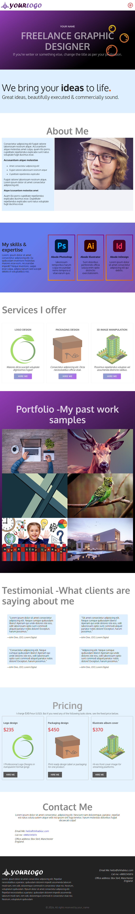

# Animated Portfolio Website Template

A clean, responsive, and lightweight one-page portfolio template built with **HTML, SCSS/CSS, and JavaScript**, enhanced with smooth scroll animations using the **AOS (Animate On Scroll)** library.

This project is designed to help you quickly build and deploy a professional portfolio website without starting from scratch.

You can view the live demo from the repository deployment.

---

## ✨ Purpose of this template

**For developers and creators** – to provide a ready-to-use, easy-to-customize portfolio website without spending a penny (including deployment).

It reflects a focus on simplicity, performance, and real-world usability.

---

## 🚀 Features

- Fully responsive layout (mobile, tablet, and desktop)
- One-page modern portfolio structure
- Smooth scroll animations using AOS
- Lightweight and fast (no CSS framework required)
- Easy customization of layout, styles, and content
- Organized SCSS structure (optional usage)

---

## 👤 Who is this for?

Originally designed with a **freelance graphic designer** layout in mind, this template is flexible enough for many professions, including:

- Web developers
- UI/UX designers
- Graphic designers
- Freelance writers
- SEO specialists
- Digital creatives and freelancers

If you're building your first portfolio or refreshing an existing one, this template gives you a solid starting point.

---

## 📱 Responsiveness

The template is fully responsive and optimized for all screen sizes. It works smoothly across:

- Mobile devices
- Tablets
- Desktop screens

No external CSS frameworks (like Bootstrap or Tailwind) are required.

---

## 🛠️ How to use

After cloning or downloading the repository:

- Open the project in your code editor
- Run the `index.html` file in your browser
- Start customizing content, styles, and sections

### About styles (SCSS/CSS)

- All styles are organized inside the `sass/` folder
- You do **not need SCSS** to use this template
- The compiled `style.css` file is fully functional on its own
- SCSS partials are included only for users who prefer modular styling

You can safely ignore the SCSS files if you're working with plain CSS. **Moreover, you don't need to edit neither the CSS nor the SCSS files if you want to keep the same layout and design as you see in the demo.** These files are included for them who have a beginner level of developer experience. Otherwise, you don't need any of these file to edit.

---

## 🎯 What makes this project useful

This template is not just a UI layout—it reflects practical frontend skills such as:

- Clean section-based architecture
- Reusable and maintainable code structure
- Integration of third-party animation libraries (AOS)
- Real-world portfolio design patterns

It is intended to save time while still giving full control over customization.

---

## 📌 License & usage

You are free to:

- Use this template for personal or commercial portfolio websites
- Modify and customize it as needed

You are **not allowed** to:

- Redistribute or resell this template as a downloadable product on other platforms

---

## 💡 Final note

This project is built as part of a broader effort to create practical, production-ready frontend templates that are easy to use and easy to extend.

If you're a recruiter reviewing this project, it demonstrates my ability to build structured, reusable, and user-focused UI templates with attention to performance and simplicity.

**If you want to use more advanced technologies to build your portfolio website, I have other repositories that are built on top of Node JS, React, Next JS, TypeScript, MongoDB, Astro JS, etc.**

## Template preview

